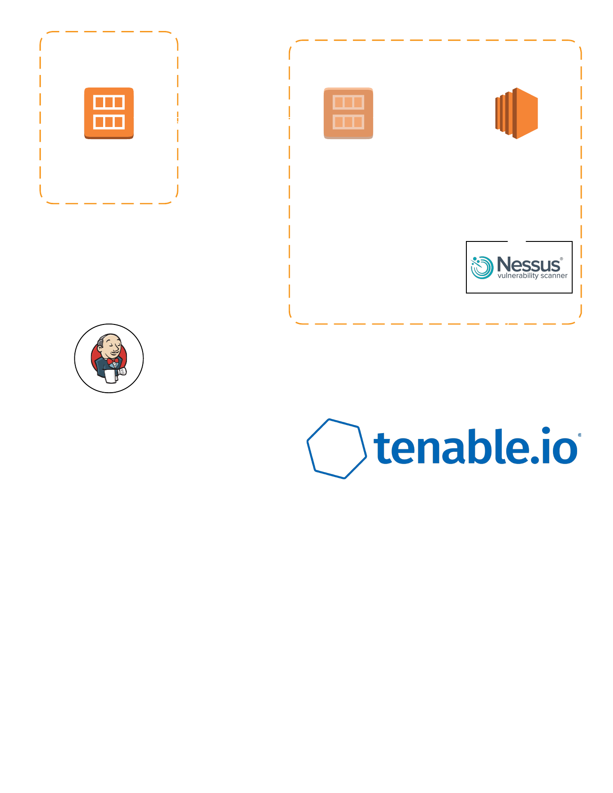

# DevOps Presentation

## Contents

- Crystal Ball
- What is DevOps?
- CI/CD
- Help?
- Real World Examples

## Challenges in SecOps / SoC

- Short Staffed, Attrition
- Distractions from Tactical and Strategic Goals
- Difficult or Impossible to be Proactive
- Disparate Systems Don't Directly Together

## What We Do / How We Help

- Bring DevOps Practices to Security
- Version Control, Automated Tests, Automated Deployment
- Bespoke Automation and Integrations

## Deep Dive

- Terraform
- Sentinel
- Git
- Vault, OIDC
- API Integrations (e.g. VMware/AWS + Tenable.sc + ServiceNow + Puppet)

## Real World Examples

### Paved Roads Initiative

### Image Scanning API

**Note: Needs dark background**

### Vulnerability Management
